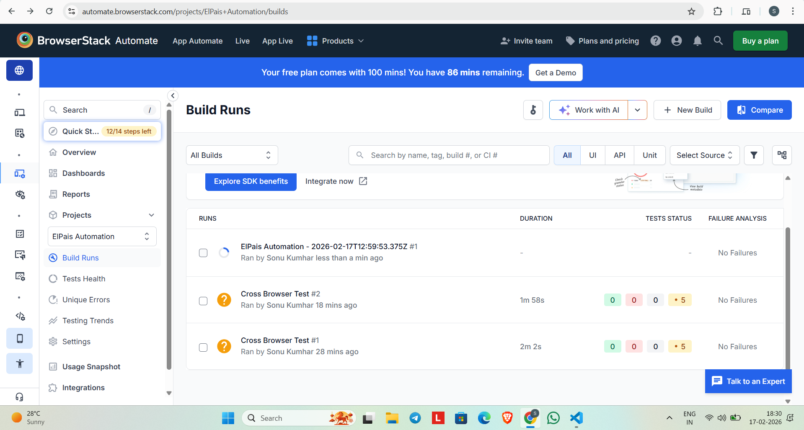
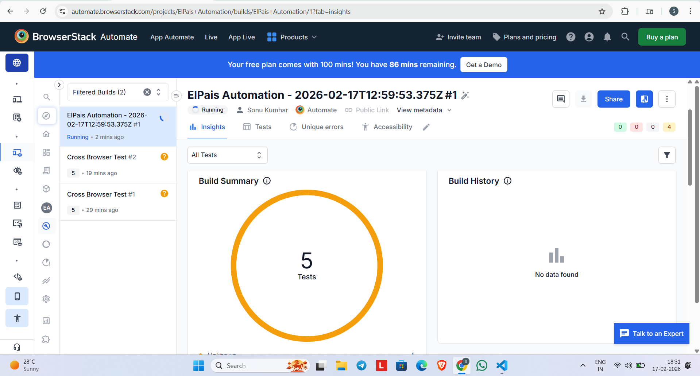
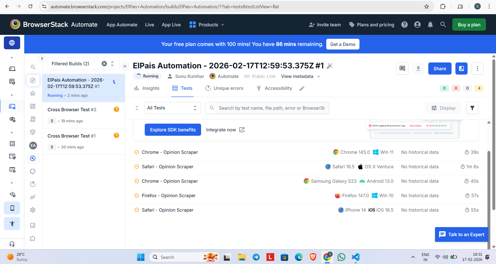
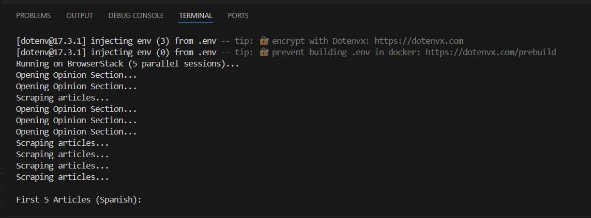
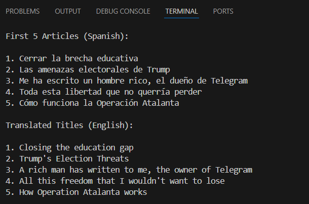

# 📰 ElPais Opinion Scraper – Cross Browser Automation
<p align="center">
  <b>Cloud Based Parallel Automation | Selenium | BrowserStack</b>
</p>

<p align="center">


</p>

---

## 📌 Project Overview

Automated cross-browser web scraping system built using **Selenium WebDriver + BrowserStack Automate**.

### 🔍 What This Project Does

- Navigates to **ElPais – Opinion Section**
- Scrapes first 5 Spanish article titles
- Translates titles into English
- Performs word frequency analysis
- Executes across 5 parallel browsers/devices in the cloud

---

## 🧠 Architecture

main.js
├── Driver Factory (Local / BrowserStack)
├── Navigation Module
├── Opinion Scraper
├── Translation Service
└── Text Analysis Service


✔ Clean modular structure  
✔ Environment-based execution  
✔ Parallel session orchestration  

---

# 🌍 Cross Browser Execution (BrowserStack)

## 1️⃣ Build Runs Dashboard



---

## 2️⃣ Build Summary – 5 Tests Executed



---

## 3️⃣ Parallel Cross-Browser Sessions



**Browsers & Devices Used:**

- Chrome – Windows 11
- Safari – macOS Ventura
- Firefox – Windows 10
- Samsung Galaxy S23 – Android 13
- iPhone 14 – iOS 16

---

## ⚡ Parallel Execution Log



Running 5 parallel sessions on BrowserStack Cloud.

---

## 🖥️ Console Output (Final Result)



Outputs:

- Spanish Titles
- English Translations
- Repeated Word Analysis

---

# ⚙️ Setup Instructions

## 1️⃣ Clone Repository

```bash
git clone <your-repo-url>
cd elpais-browserstack-automation
2️⃣ Install Dependencies
npm install
3️⃣ Configure Environment Variables
Create .env file using .env.example:

BROWSERSTACK_USERNAME=your_username
BROWSERSTACK_ACCESS_KEY=your_access_key
RUN_MODE=browserstack
To run locally:
RUN_MODE=local
4️⃣ Run Project
npm run dev
🧪 Execution Modes
Mode	Description
local	Runs on local Chrome browser
browserstack	Runs 5 parallel sessions on BrowserStack
🛡️ Best Practices Followed
✔ Secure credentials using .env
✔ .env ignored in Git
✔ Clean logging structure
✔ Modular code separation
✔ Parallel execution handling
✔ Cloud test reporting

📊 Project Highlights
5 Parallel Cloud Sessions

Cross Platform Testing

Modular Service Architecture

Translation + Text Analytics Layer

Real Browser Cloud Execution

👨‍💻 Author
Sonu Kumhar
Automation Engineer | Web Scraping | Cross Browser Testing